# System Architecture

```mermaid
graph TD
    %% Frontend
    subgraph Frontend["$tashly Frontend"]
        direction LR
        WEBAPP[TypeScript Web App]:::frontend
        WEBAPP --> SIMLI[Simli Widget]:::frontend
        WEBAPP --> YFIN_FE[Yahoo Finance]:::frontend
    end

    %% Infrastructure
    subgraph Azure["Azure Cloud"]
        direction LR
        AKS[AKS]:::azure
        ACR[ACR]:::azure
        KV[Key Vault]:::azure
        MON[Monitor]:::azure
        NET[Network]:::azure
    end

    subgraph Backend["$tashly Backend"]
        direction LR
        APP[app.py<br>• stream_response<br>• chat_completions<br>• chat_endpoint<br>• get_conversation_history<br>• clear_conversation_history<br>• proxy_simli_session<br>• simli_connect<br>• test_endpoint<br>• test_simli_api<br>• test_architecture<br>• root]:::backend --> SUP[supervisor<br>• route_message_node<br>• route_decision<br>• should_continue<br>• process_user_input]:::backend
        
        %% Agents Group
        subgraph Agents["Agents"]
            direction LR
            SUP --> PORT[portfolio<br>• calculate_performance<br>• generate_data_table<br>• calculate_annual_returns<br>• get_market_data_for_chart]:::agent
            SUP --> FUND[fund<br>• total_exposure_to_company<br>• fund_exposure_lookup<br>• sector_exposure_lookup<br>• fund_holdings_table]:::agent
            SUP --> MRKT[market<br>• search_wikipedia<br>• search_web<br>• generate_chart<br>• get_date_range]:::agent
            SUP --> CONV[conversational<br>• get_persona<br>• respond_direct<br>• run_conversational_agent]:::agent
            SUP --> WEB[websearch<br>• search_web<br>• search_wikipedia<br>• search_web_tool<br>• search_wikipedia_tool]:::agent
            SUP --> STOCK[stock<br>• resolve_ticker<br>• query_stock_info<br>• run_stock_price_agent]:::agent
            SUP --> RS[research<br>• break_down_topic<br>• write_report<br>• create_analysts]:::agent
        end
    end

    %% Research System
    subgraph Research["Research System"]
        direction LR
        RS --> AN[analysis<br>• break_down_topic<br>• run_analyst_agent]:::research
        RS --> ED[editor<br>• write_report<br>• write_intro_or_conclusion<br>• finalize_report]:::research
        RS --> EX[expert<br>• create_analysts]:::research
    end

    %% External APIs
    subgraph APIs["External APIs"]
        direction LR
        OPENAI[OpenAI]:::api
        YFIN[Yahoo Finance]:::api
        WIKI[Wikipedia]:::api
        SEARCH[Web Search]:::api
        FIGI[Figi API]:::api
        LANG[Langsmith]:::api
    end

    %% Version Control
    subgraph VCS["Version Control"]
        direction LR
        GH[GitHub]:::vcs
    end

    %% Knowledge Base
    subgraph KB["Knowledge Base"]
        direction LR
        FUNDDATA[Fund Data]:::data
        MARKETDATA[Market Data]:::data
        PERSONA[Ashley Persona]:::data
    end

    %% Connections
    WEBAPP --> Azure
    APP --> AKS
    AKS --> ACR
    AKS --> KV
    AKS --> MON
    AKS --> NET

    %% Backend to Knowledge Base
    SUP --> KB
    PORT --> KB
    FUND --> KB
    MRKT --> KB
    CONV --> KB
    WEB --> KB
    STOCK --> KB

    %% API Connections
    PORT --> YFIN
    STOCK --> YFIN
    WEB --> WIKI
    WEB --> SEARCH
    MRKT --> WIKI
    MRKT --> SEARCH
    PORT --> FIGI
    FUND --> FIGI
    STOCK --> FIGI

    %% OpenAI Connections
    PORT --> OPENAI
    FUND --> OPENAI
    MRKT --> OPENAI
    CONV --> OPENAI
    WEB --> OPENAI
    STOCK --> OPENAI
    AN --> OPENAI
    ED --> OPENAI
    EX --> OPENAI

    %% Langsmith Connections
    SUP --> LANG
    PORT --> LANG
    FUND --> LANG
    MRKT --> LANG
    CONV --> LANG
    WEB --> LANG
    STOCK --> LANG

    %% Color Definitions
    classDef frontend fill:#e1f5fe,stroke:#01579b,stroke-width:2px
    classDef backend fill:#f3e5f5,stroke:#4a148c,stroke-width:2px
    classDef agent fill:#e8f5e9,stroke:#1b5e20,stroke-width:2px
    classDef research fill:#fff3e0,stroke:#e65100,stroke-width:2px
    classDef api fill:#fce4ec,stroke:#880e4f,stroke-width:2px
    classDef data fill:#f3e5f5,stroke:#4a148c,stroke-width:2px
    classDef azure fill:#e3f2fd,stroke:#1565c0,stroke-width:2px
    classDef vcs fill:#f5f5f5,stroke:#24292e,stroke-width:2px
```

## System Components

### 1. Frontend Application ($tashly)
- **TypeScript Web App**: Modern web application hosted on Lovable platform
- **Simli Avatar Widget**: Interactive avatar interface
- **Yahoo Finance API**: Direct market data access

### 2. Backend Application ($tashly)
- **app.py**: FastAPI application server handling HTTP requests
- **supervisor_agent.py**: Orchestrates agent interactions and routing
- **types.py**: Shared type definitions

### 3. Agent Layer
- **portfolio_agent.py**: Portfolio analysis and management
- **fund_position_agent.py**: Fund holdings and exposure analysis
- **market_report_agent.py**: Market data analysis and reporting
- **conversational_agent.py**: Natural language interaction
- **websearch_agent.py**: Web research capabilities
- **stock_price_agent.py**: Stock market data analysis
- **fund_loader.py**: Fund data parsing and loading

### 4. Research System
- **research_supervisor.py**: Coordinates research tasks
- **analys_agent.py**: Topic analysis and breakdown
- **editor_agent.py**: Content generation and editing
- **expert_agent.py**: Domain expertise application

### 5. External APIs
- OpenAI API: Language model and AI capabilities (accessed by all agents)
- Yahoo Finance: Stock market data
- Wikipedia: Knowledge base
- Web Search: Internet research
- Simli API: Avatar interaction
- Figi API: Sector search and classification data
- Langsmith: Agent tracing and monitoring

### 6. Knowledge Base
- Fund Data: Fund holdings and positions
- Market Data: Historical market data
- Ashley Persona: Conversational personality

### 7. Infrastructure
- **Azure Kubernetes Service (AKS)**: Container orchestration and management
- **Azure Container Registry (ACR)**: Container image storage and management
- **Azure Key Vault (KV)**: Secrets and configuration management
- **Azure Monitor**: Application monitoring and logging
- **Azure Network**: Network security and connectivity

### 8. Version Control
- **GitHub Repository**: Local source code management and storage

## Data Flow

1. User interacts with $tashly frontend application (hosted on Lovable)
2. Frontend makes API calls to Azure-hosted backend
3. User requests enter through `app.py`
4. `supervisor_agent.py` routes requests to appropriate agents
5. Agents process requests using their specialized capabilities and OpenAI integration
6. Market agent can access web search and Wikipedia for additional context
7. Portfolio and fund agents access Figi API for sector data
8. All agents are traced through Langsmith for monitoring
9. Results are aggregated and returned to the user
10. Research system can be called for in-depth analysis
11. All agents can access relevant external APIs and knowledge base
12. Infrastructure components handle deployment, security, and scaling

## Key Features

- Modern TypeScript frontend application
- Interactive avatar interface
- Direct market data access
- Modular architecture with specialized agents
- Real-time market data processing
- Fund portfolio analysis
- Natural language interaction
- Web research capabilities
- Stock market analysis
- Research supervision system
- Content generation and editing
- Kubernetes-based container orchestration
- Cloud-native infrastructure
- Secure secrets management
- Comprehensive monitoring and logging
- Universal OpenAI integration across all agents
- Sector classification via Figi API
- Agent tracing and monitoring via Langsmith 